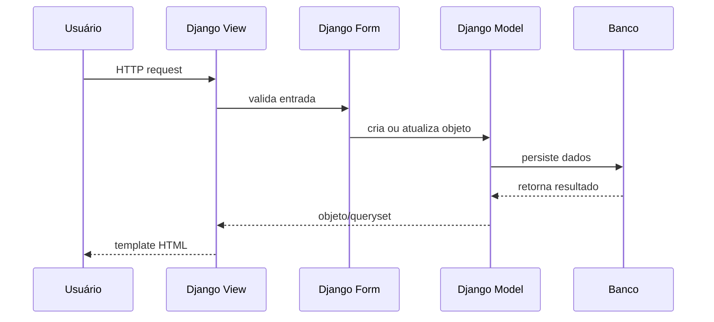

# Arquitetura

O FinanPy é uma aplicação Django server-rendered que segue o padrão MVT
do Django: models, views e templates.

## Componentes

```mermaid
graph TD
    Browser[Browser/PWA] --> Nginx[Nginx do host]
    Nginx --> Gunicorn[Gunicorn no container web]
    Gunicorn --> Django[Django]
    Django --> PostgreSQL[(PostgreSQL em produção)]
    Django --> SQLite[(SQLite em desenvolvimento)]
    Nginx --> Static[/srv/finanpy/staticfiles]
    Nginx --> Media[/srv/finanpy/media]
```

## Apps

- `users`: usuário customizado, autenticação, cadastro, login, logout,
  reset e alteração de senha.
- `profiles`: perfil complementar criado automaticamente para cada usuário.
- `accounts`: contas financeiras.
- `categories`: categorias de receita/despesa com hierarquia.
- `tags`: tags livres, escopadas por usuário, associadas a transações.
- `transactions`: receitas, despesas, status, recorrência, tags e atualização
  automática de saldo.
- `budgets`: orçamentos por categoria de despesa, planejamento mensal e alertas
  por limite.
- `goals`: metas financeiras com aportes e progresso calculado por signal.
- `api`: endpoints REST autenticados para contas, categorias, tags, transações,
  orçamentos, metas, planejamento mensal, resumos, snapshot e sincronização.
- `theme`: integração `django-tailwind` para build local do CSS.
- `core`: settings, URLs raiz, WSGI e ASGI.

## Fluxo de Dados



## Segurança de Dados

Os dados financeiros são escopados por usuário:

- Views autenticadas usam `LoginRequiredMixin`.
- Querysets filtram por `request.user`.
- Forms recebem o usuário quando necessário para validar ownership.
- Models validam relações críticas, como conta/categoria do mesmo usuário.

## Signals

Signals são usados onde há consistência automática de domínio:

- `profiles.signals`: cria perfil automaticamente ao criar usuário.
- `transactions.signals`: atualiza saldo da conta ao criar, editar ou remover
  transações.
- `budgets.signals`: atualiza ou limpa cache de orçamento quando transações ou
  orçamentos mudam.
- `goals.signals`: recalcula valor atual e status das metas quando aportes são
  criados ou removidos.

## API REST

A API atual usa Django REST Framework com autenticação por token e permissão
`IsAuthenticated` por padrão.

Endpoints implementados em `/api/v1/`:

- `accounts/`: CRUD de contas do usuário autenticado.
- `categories/`: CRUD de categorias ativas do usuário autenticado, com filtro
  opcional `type=INCOME|EXPENSE`.
- `tags/`: CRUD de tags do usuário autenticado.
- `transactions/`: CRUD de transações do usuário autenticado, com filtros por
  tipo, ano, mês, conta, categoria, status e tag.
- `transactions/quick/`: criação rápida de transação.
- `transactions/from-receipt/`: recebe imagem/PDF de comprovante e retorna draft
  de transação para confirmação manual; OCR local ainda não está integrado.
- `budgets/`: CRUD de orçamentos.
- `goals/`: CRUD de metas.
- `goal-contributions/`: CRUD de aportes em metas.
- `monthly-plans/`: CRUD e ações de planejamento mensal.
- `monthly-plan-items/`: itens do planejamento mensal.
- `summary/monthly/`: resumo mensal por `year` e `month`.
- `summary/yearly/`: resumo anual por `year`.
- `dashboard/snapshot/`: snapshot consolidado para PWA/Hermes.
- `sync/since/`: sincronização incremental para clientes.

## PWA e Mobile

O frontend atual é server-rendered, mobile-first e instalável como PWA:

- `static/manifest.webmanifest`: manifest, shortcuts, share target e protocol
  handlers.
- `/sw.js`: service worker servido na raiz para escopo correto.
- `/offline/`: fallback offline.
- `/handler/`: resolve deeplinks `web+finanpy://...` para rotas internas.
- `templates/base.html`: shell com top bar, drawer, bottom nav e FAB.

## Produção

O deploy oficial atual usa:

- VPS Ubuntu em `root@38.52.128.62`.
- URL pública temporária `https://www.investiorion.com/`.
- Futuro domínio `https://finanpy.com.br/`.
- Docker Compose com `docker-compose.vps.yml`.
- PostgreSQL no container `finanpy-db-1`.
- Gunicorn no container `finanpy-web-1`, exposto apenas em
  `127.0.0.1:8001`.
- Nginx do host para TLS, proxy, static e media.
- GitHub Actions com deploy SSH para `/srv/apps/finanpy/deploy.sh`.
- Variáveis de ambiente em `core.settings_production`.

Não fazem parte da arquitetura atual:

- Redis.
- Celery.
- Sentry.
- S3.
