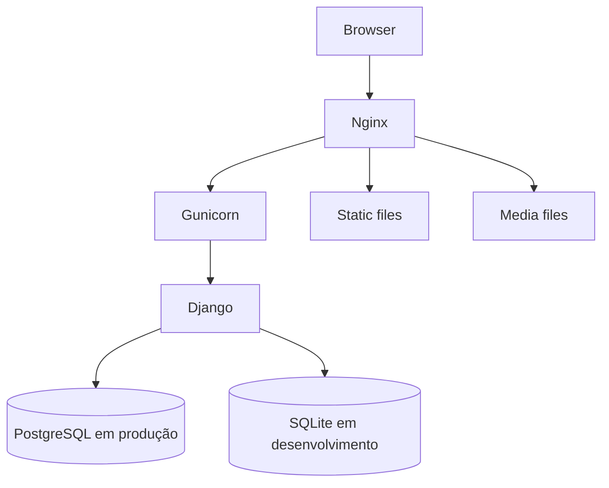
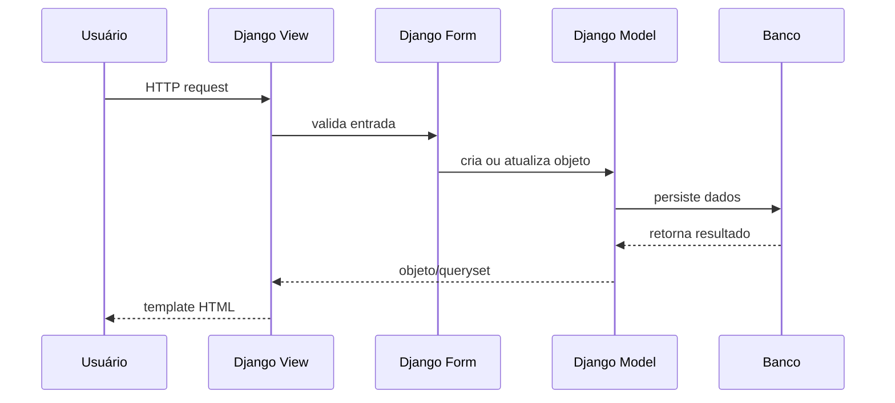

# Arquitetura

O FinanPy é uma aplicação Django server-rendered que segue o padrão MVT
do Django: models, views e templates.

## Componentes

## Apps

- `users`: usuário customizado, autenticação, cadastro, login, logout,
  reset e alteração de senha.
- `profiles`: perfil complementar criado automaticamente para cada usuário.
- `accounts`: contas financeiras.
- `categories`: categorias de receita/despesa com hierarquia.
- `transactions`: receitas, despesas e atualização automática de saldo.
- `budgets`: orçamentos por categoria de despesa e alertas por limite.
- `goals`: metas financeiras com aportes e progresso calculado por signal.
- `api`: endpoints REST autenticados para contas, categorias, transações e
  resumos mensal/anual.
- `core`: settings, URLs raiz, WSGI e ASGI.

## Fluxo de Dados

## Segurança de Dados

Os dados financeiros são escopados por usuário:

- Views autenticadas usam `LoginRequiredMixin`.
- Querysets filtram por `request.user`.
- Forms recebem o usuário quando necessário para validar ownership.
- Models validam relações críticas, como conta/categoria do mesmo usuário.

## Signals

Signals são usados onde há consistência automática de domínio:

- `profiles.signals`: cria perfil automaticamente ao criar usuário.
- `transactions.signals`: atualiza saldo da conta ao criar, editar ou remover
  transações.
- `budgets.signals`: atualiza ou limpa cache de orçamento quando transações ou
  orçamentos mudam.
- `goals.signals`: recalcula valor atual e status das metas quando aportes são
  criados ou removidos.

## API REST

A API atual usa Django REST Framework com autenticação por token e permissão
`IsAuthenticated` por padrão.

Endpoints implementados em `/api/v1/`:

- `accounts/`: CRUD de contas do usuário autenticado.
- `categories/`: CRUD de categorias ativas do usuário autenticado, com filtro
  opcional `type=INCOME|EXPENSE`.
- `transactions/`: CRUD de transações do usuário autenticado, com filtros por
  tipo, ano, mês, conta e categoria.
- `summary/monthly/`: resumo mensal por `year` e `month`.
- `summary/yearly/`: resumo anual por `year`.

## Produção

O deploy oficial atual usa:

- Docker Compose.
- PostgreSQL.
- Gunicorn.
- Nginx para proxy, static e media.
- Variáveis de ambiente em `core.settings_production`.

Não fazem parte da arquitetura atual:

- Redis.
- Celery.
- Sentry.
- S3.
- API REST para orçamentos, metas, perfis ou relatórios avançados.
