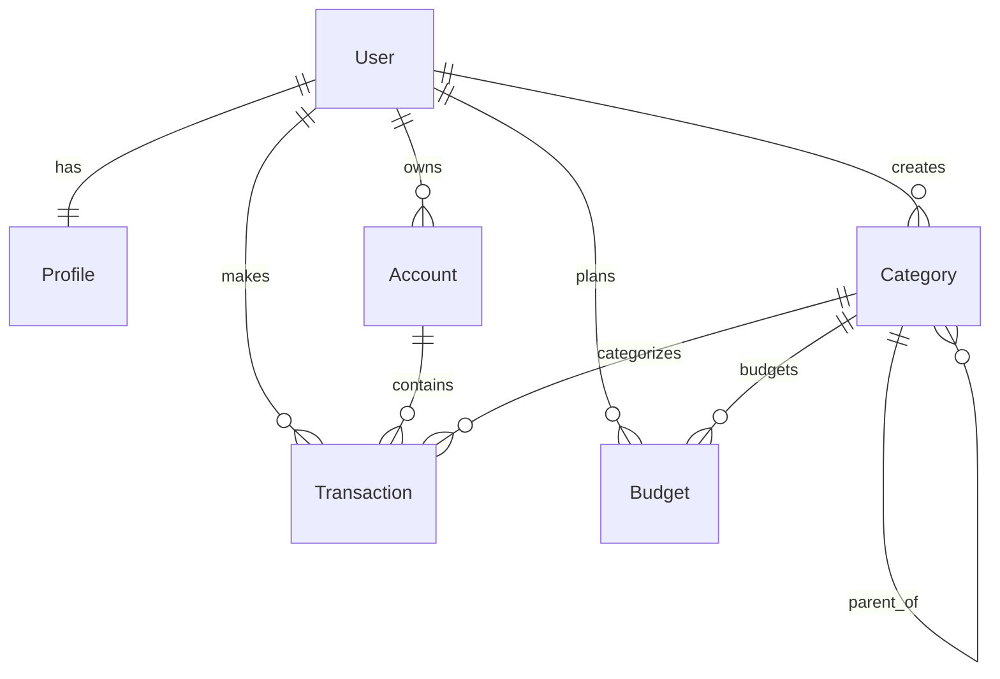

# Estrutura do Banco de Dados

Este documento descreve os models implementados hoje no código. Models e campos
planejados, mas inexistentes, ficam em `docs/backlog.md`.

## Visão Geral

## User

App: `users`

Model customizado baseado em `AbstractUser`, com autenticação por email.

Campos relevantes:

- `email`: único e usado como `USERNAME_FIELD`.
- `username`: opcional, gerado a partir do email quando ausente.
- Campos herdados do Django: `password`, `first_name`, `last_name`,
  `is_active`, `is_staff`, `is_superuser`, `date_joined`, `last_login`.

Configuração:

- `AUTH_USER_MODEL = "users.User"`.
- Tabela definida como `auth_user`.

## Profile

App: `profiles`

Perfil criado automaticamente via signal quando um usuário é criado.

Campos:

- `user`: `OneToOneField` para o usuário.
- `first_name`: nome complementar do perfil.
- `last_name`: sobrenome complementar do perfil.
- `phone`: telefone opcional validado por regex.
- `birth_date`: data de nascimento opcional.
- `bio`: biografia curta opcional.
- `created_at`: criação.
- `updated_at`: última atualização.

Não existem hoje:

- Avatar.
- JSON de preferências.

## Account

App: `accounts`

Conta financeira pertencente a um usuário.

Campos:

- `user`: dono da conta.
- `name`: nome da conta.
- `account_type`: `checking`, `savings`, `credit_card`, `investment`, `cash`.
- `balance`: saldo atual.
- `currency`: `USD`, `EUR`, `BRL`, `GBP`, `CAD`.
- `is_active`: indica se a conta está ativa.
- `created_at`: criação.
- `updated_at`: última atualização.

Regras:

- Nome único por usuário.
- Validação por `clean()` antes de salvar.
- Saldo é atualizado automaticamente pelos signals de transação.

## Category

App: `categories`

Categoria de receita ou despesa, com suporte hierárquico.

Campos:

- `user`: dono da categoria.
- `name`: nome.
- `category_type`: `INCOME` ou `EXPENSE`.
- `color`: cor hexadecimal.
- `icon`: emoji usado na interface.
- `parent`: categoria pai opcional.
- `is_active`: indica se a categoria está ativa.
- `created_at`: criação.

Regras:

- Nome único por usuário e tipo.
- Categoria pai deve ser do mesmo usuário.
- Categoria pai deve ser do mesmo tipo.
- O model impede ciclos na hierarquia.

## Transaction

App: `transactions`

Movimentação financeira de receita ou despesa.

Campos:

- `user`: dono da transação.
- `account`: conta impactada.
- `category`: categoria.
- `transaction_type`: `INCOME` ou `EXPENSE`.
- `amount`: valor positivo.
- `description`: descrição curta.
- `transaction_date`: data da transação.
- `notes`: observações opcionais.
- `is_recurring`: marca se é recorrente.
- `recurrence_type`: frequência quando recorrente.
- `created_at`: criação.
- `updated_at`: última atualização.

Regras:

- Valor deve ser positivo.
- Data não pode ser futura.
- Conta e categoria devem pertencer ao mesmo usuário.
- Categoria deve estar ativa e ter tipo compatível com a transação.
- Se `is_recurring=True`, `recurrence_type` é obrigatório.

Signals:

- Criação de receita aumenta saldo da conta.
- Criação de despesa reduz saldo da conta.
- Edição reverte impacto antigo e aplica o novo.
- Remoção reverte o impacto da transação.

## Budget

App: `budgets`

Orçamento por categoria de despesa e período.

Campos:

- `user`: dono do orçamento.
- `category`: categoria de despesa.
- `name`: nome.
- `planned_amount`: valor planejado.
- `start_date`: início do período.
- `end_date`: fim do período.
- `is_active`: indica se está ativo.
- `_cached_spent_amount`: cache interno do valor gasto.
- `_cache_updated_at`: data da última atualização do cache.
- `created_at`: criação.
- `updated_at`: última atualização.

Regras:

- Valor planejado deve ser positivo.
- Data final deve ser maior ou igual à inicial.
- Período não pode exceder 1 ano.
- Categoria deve pertencer ao usuário.
- Categoria deve ser `EXPENSE`.
- Não permite orçamentos ativos sobrepostos para a mesma categoria.

Signals:

- Transações de despesa atualizam o cache dos orçamentos afetados.
- Atualizações no orçamento limpam o cache para recálculo.

## Goals

App: `goals`

O app existe no repositório, mas não possui model implementado. A funcionalidade
de metas está no backlog.
